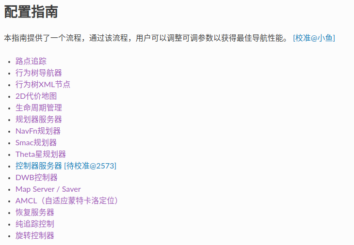

# 2.为FishBot配置Nav2

安装好了Nav2，我们开始针对我们的fishbot改变一些参数进行导航相关的参数配置。Nav2可配置的参数比起Cartographer更多，但是不要害怕，因为大多数参数我们可能不会改变。

> 有关Nav2的更多参数介绍和详细的配置意义，可以参考**Nav2中文网配置指南**一节。

本节主要准备两个文件给launch节点使用，第一个是地图文件，第二个是nav2参数文件。

## 1.创建fishbot_navigation2

### 1.1创建功能包

和前面在Cartographer中一样，我们需要创建一个文件夹放置配置文件、launch文件、rviz配置和地图等。

进入到src目录下，使用下面指令创建功能包：

```shell
ros2 pkg create fishbot_navigation2 --dependencies nav2_bringup
```

这里我们添加了一个依赖`nav2_bringup`，后面写launch文件要用到，这里提前添加一下依赖。

创建完成后的目录结构：

```
.
├── CMakeLists.txt
├── include
│   └── fishbot_navigation2
├── package.xml
└── src

3 directories, 2 files
```

### 1.2 添加maps文件夹

```
cd src/fishbot_navigation2
mkdir launch config maps param rviz
```

### 1.3 复制地图文件

将上一节的地图文件复制到map文件夹下。

复制完成后`fishbot_navigation2`的文件结构如下

```
.
├── CMakeLists.txt
├── config
├── launch
├── maps
│   ├── fishbot_map.png
│   ├── fishbot_map.pgm
│   ├── fishbot_map.yaml
├── package.xml
├── param
└── rviz

5 directories, 5 files
```

## 2.添加Nav2配置文件

### 2.1 创建参数文件

我们需要配置的文件是Nav2的参数文件，同样的，贴心的Nav2已经为我们准备好了参数模板

```
src/navigation2/nav2_bringup/bringup/params/nav2_params.yaml
```

在`src/fishbot_navigation2/param/`目录下创建`fishbot_nav2.yaml`

```shell
cd src/fishbot_navigation2/param/
touch fishbot_nav2.yaml
```

### 2.2 复制参数

然后将`src/navigation2/nav2_bringup/bringup/params/nav2_params.yaml`的内容复制粘贴到`fishbot_nav2.yaml`文件中。

> **参数文件中的参数是谁的？**
>
> 在[5.1.4章节保存参数](chapt5/5.1ROS2参数介绍?id=_4体验参数)中，我们曾用`ros2 param dump <node_name>`指令将某个节点的参数保存为一个`.yaml`格式的文件。`fishbot_nav2.yaml`文件就是保存Nav2相关节点参数的文件。

## 3. 配置参数

其实参数不配置也是可以将Nav2跑起来的，但是后期想要更改运行的效果就需要对参数进行修改，所以有必要大概了解下参数的配置项和含义查询方法和修改方法。

### 3.1 参数列表

| 编号 | 配置项            | 用途                                                  | 对应模块与参数详解                                           |
| ---- | ----------------- | ----------------------------------------------------- | ------------------------------------------------------------ |
| 1    | amcl              | 机器人定位                                            | [nav2_amcl](http://dev.nav2.fishros.com/doc/configuration/packages/configuring-amcl.html) |
| 2    | bt_navigator      | 导航行为树（用于加载行为树节点并根据xml配置进行调度） | [nav2_bt_navigator](http://dev.nav2.fishros.com/doc/configuration/packages/configuring-bt-navigator.html),[nav2_behavior_tree](http://dev.nav2.fishros.com/doc/configuration/packages/configuring-bt-xml.html) |
| 3    | controller_server | 控制器服务器                                          | [nav2_controller](http://dev.nav2.fishros.com/doc/configuration/packages/configuring-controller-server.html),[nav2_dwb_controller](http://dev.nav2.fishros.com/doc/configuration/packages/configuring-dwb-controller.html),[nav2_regulated_pure_pursuit_controller](http://dev.nav2.fishros.com/doc/configuration/packages/configuring-regulated-pp.html) |
| 4    | planner_server    | 规划服务器                                            | [nav2_planner](http://dev.nav2.fishros.com/doc/configuration/packages/configuring-planner-server.html),[nav2_navfn_planner](http://dev.nav2.fishros.com/doc/configuration/packages/configuring-navfn.html),[smac_planner](http://dev.nav2.fishros.com/doc/configuration/packages/configuring-smac-planner.html) |
| 5    | recoveries_server | 恢复服务器                                            | [nav2_recoveries](http://dev.nav2.fishros.com/doc/configuration/packages/configuring-recovery-server.html) |
| 6    | local_costmap     | 局部代价地图                                          | [nav2_costmap_2d](http://dev.nav2.fishros.com/doc/configuration/packages/configuring-costmaps.html),[static_layer](http://dev.nav2.fishros.com/doc/configuration/packages/costmap-plugins/static.html),[inflation_layer](http://dev.nav2.fishros.com/doc/configuration/packages/costmap-plugins/inflation.html) |
| 7    | global_costmap    | 全局代价地图                                          | [nav2_costmap_2d](http://dev.nav2.fishros.com/doc/configuration/packages/configuring-costmaps.html),[nav2_map_server](http://dev.nav2.fishros.com/doc/configuration/packages/configuring-map-server.html) |


有关更多的Nav2所有参数的详细介绍，可以访问Nav2中文网中的配置指南章节，非常的详细，无比的具体。



### 3.2 配置机器人半径和碰撞半径

在全局代价地图和局部代价地图配置用，默认的机器人半径是0.22，而我们fishbot的半径是0.12，所以需要修改机器人的半径为0.12。

```yaml
local_costmap:
  local_costmap:
    ros__parameters:
      robot_radius: 0.12
      
global_costmap:
  global_costmap:
    ros__parameters:
      robot_radius: 0.12
```

为了防止机器人发生碰撞，一般我们会给代价地图添加一个碰撞层（inflation_layer），在`local_costmap`和`global_costmap`配置中，你可以看到下面关于代价地图相关的配置：

```yaml
global_costmap:
  global_costmap:
    ros__parameters:
      plugins: ["static_layer", "obstacle_layer", "inflation_layer"]
      inflation_layer:
        plugin: "nav2_costmap_2d::InflationLayer"
        cost_scaling_factor: 3.0
        inflation_radius: 0.55
```

打开参数配置中的[inflation_layer](http://dev.nav2.fishros.com/doc/configuration/packages/costmap-plugins/inflation.html)，我们来看看其配置项和含义。


可以看到`inflation_radius`默认0.55对fishbot来说可能有些大了，我们改小些。

```
global_costmap:
  global_costmap:
    ros__parameters:
      plugins: ["static_layer", "obstacle_layer", "inflation_layer"]
      inflation_layer:
        plugin: "nav2_costmap_2d::InflationLayer"
        cost_scaling_factor: 3.0
        inflation_radius: 0.35
```

**以上就是以代价地图碰撞半径为例的配置方法，nav2可以配置的参数非常多，假如你在导航过程中遇到问题，根据问题的表现推断下是哪个模块中造成的，接着修改其对应参数，大概率就可以解决问题，解决不了的可以看源码详细分析。**

### 3.3 配置frame_id和话题

这里也不用配置，因为我们的fishbot话题名称和tf名称都是遵循着默认的话题的。

如果你的机器人不是，或者你改变了话题，这里就需要重新配置。

- 默认全局的坐标系：map
- 默认里程计坐标系：odom
- 默认雷达话题：scan
- 默认机器人基坐标系：base_link
- 默认地图话题：map


## 4. 总结

本节我们简单的了解了Nav2各个模块参数的配置方法和参数的介绍，下一节就开始编写文件正式建图。


## 完整的配置文件如下
```
amcl:
  ros__parameters:
    use_sim_time: True
    alpha1: 0.2
    alpha2: 0.2
    alpha3: 0.2
    alpha4: 0.2
    alpha5: 0.2
    base_frame_id: "base_link"
    beam_skip_distance: 0.5
    beam_skip_error_threshold: 0.9
    beam_skip_threshold: 0.3
    do_beamskip: false
    global_frame_id: "map"
    lambda_short: 0.1
    laser_likelihood_max_dist: 2.0
    laser_max_range: 100.0
    laser_min_range: -1.0
    laser_model_type: "likelihood_field"
    max_beams: 60
    max_particles: 2000
    min_particles: 500
    odom_frame_id: "odom"
    pf_err: 0.05
    pf_z: 0.99
    recovery_alpha_fast: 0.0
    recovery_alpha_slow: 0.0
    resample_interval: 1
    robot_model_type: "nav2_amcl::DifferentialMotionModel"
    save_pose_rate: 0.5
    sigma_hit: 0.2
    tf_broadcast: true
    transform_tolerance: 10.0
    update_min_a: 0.2
    update_min_d: 0.25
    z_hit: 0.5
    z_max: 0.05
    z_rand: 0.5
    z_short: 0.05
    scan_topic: scan

amcl_map_client:
  ros__parameters:
    use_sim_time: True

amcl_rclcpp_node:
  ros__parameters:
    use_sim_time: True

bt_navigator:
  ros__parameters:
    use_sim_time: True
    global_frame: map
    robot_base_frame: base_link
    odom_topic: /odom
    bt_loop_duration: 10
    default_server_timeout: 20
    # 'default_nav_through_poses_bt_xml' and 'default_nav_to_pose_bt_xml' are use defaults:
    # nav2_bt_navigator/navigate_to_pose_w_replanning_and_recovery.xml
    # nav2_bt_navigator/navigate_through_poses_w_replanning_and_recovery.xml
    # They can be set here or via a RewrittenYaml remap from a parent launch file to Nav2.
    plugin_lib_names:
    - nav2_compute_path_to_pose_action_bt_node
    - nav2_compute_path_through_poses_action_bt_node
    - nav2_smooth_path_action_bt_node
    - nav2_follow_path_action_bt_node
    - nav2_spin_action_bt_node
    - nav2_wait_action_bt_node
    - nav2_back_up_action_bt_node
    - nav2_drive_on_heading_bt_node
    - nav2_clear_costmap_service_bt_node
    - nav2_is_stuck_condition_bt_node
    - nav2_goal_reached_condition_bt_node
    - nav2_goal_updated_condition_bt_node
    - nav2_globally_updated_goal_condition_bt_node
    - nav2_is_path_valid_condition_bt_node
    - nav2_initial_pose_received_condition_bt_node
    - nav2_reinitialize_global_localization_service_bt_node
    - nav2_rate_controller_bt_node
    - nav2_distance_controller_bt_node
    - nav2_speed_controller_bt_node
    - nav2_truncate_path_action_bt_node
    - nav2_truncate_path_local_action_bt_node
    - nav2_goal_updater_node_bt_node
    - nav2_recovery_node_bt_node
    - nav2_pipeline_sequence_bt_node
    - nav2_round_robin_node_bt_node
    - nav2_transform_available_condition_bt_node
    - nav2_time_expired_condition_bt_node
    - nav2_path_expiring_timer_condition
    - nav2_distance_traveled_condition_bt_node
    - nav2_single_trigger_bt_node
    - nav2_is_battery_low_condition_bt_node
    - nav2_navigate_through_poses_action_bt_node
    - nav2_navigate_to_pose_action_bt_node
    - nav2_remove_passed_goals_action_bt_node
    - nav2_planner_selector_bt_node
    - nav2_controller_selector_bt_node
    - nav2_goal_checker_selector_bt_node
    - nav2_controller_cancel_bt_node
    - nav2_path_longer_on_approach_bt_node
    - nav2_wait_cancel_bt_node
    - nav2_spin_cancel_bt_node
    - nav2_back_up_cancel_bt_node
    - nav2_drive_on_heading_cancel_bt_node

bt_navigator_rclcpp_node:
  ros__parameters:
    use_sim_time: True

controller_server:
  ros__parameters:
    use_sim_time: True
    controller_frequency: 20.0
    min_x_velocity_threshold: 0.001
    min_y_velocity_threshold: 0.5
    min_theta_velocity_threshold: 0.001
    failure_tolerance: 0.3
    progress_checker_plugin: "progress_checker"
    goal_checker_plugins: ["general_goal_checker"] # "precise_goal_checker"
    controller_plugins: ["FollowPath"]

    # Progress checker parameters
    progress_checker:
      plugin: "nav2_controller::SimpleProgressChecker"
      required_movement_radius: 0.5
      movement_time_allowance: 10.0
    # Goal checker parameters
    #precise_goal_checker:
    #  plugin: "nav2_controller::SimpleGoalChecker"
    #  xy_goal_tolerance: 0.25
    #  yaw_goal_tolerance: 0.25
    #  stateful: True
    general_goal_checker:
      stateful: True
      plugin: "nav2_controller::SimpleGoalChecker"
      xy_goal_tolerance: 0.25
      yaw_goal_tolerance: 0.25
    # DWB parameters
    FollowPath:
      plugin: "dwb_core::DWBLocalPlanner"
      debug_trajectory_details: True
      min_vel_x: 0.0
      min_vel_y: 0.0
      max_vel_x: 0.26
      max_vel_y: 0.0
      max_vel_theta: 1.0
      min_speed_xy: 0.0
      max_speed_xy: 0.26
      min_speed_theta: 0.0
      # Add high threshold velocity for turtlebot 3 issue.
      # https://github.com/ROBOTIS-GIT/turtlebot3_simulations/issues/75
      acc_lim_x: 2.5
      acc_lim_y: 0.0
      acc_lim_theta: 3.2
      decel_lim_x: -2.5
      decel_lim_y: 0.0
      decel_lim_theta: -3.2
      vx_samples: 20
      vy_samples: 5
      vtheta_samples: 20
      sim_time: 1.7
      linear_granularity: 0.05
      angular_granularity: 0.025
      transform_tolerance: 0.2
      xy_goal_tolerance: 0.25
      trans_stopped_velocity: 0.25
      short_circuit_trajectory_evaluation: True
      stateful: True
      critics: ["RotateToGoal", "Oscillation", "BaseObstacle", "GoalAlign", "PathAlign", "PathDist", "GoalDist"]
      BaseObstacle.scale: 0.02
      PathAlign.scale: 32.0
      PathAlign.forward_point_distance: 0.1
      GoalAlign.scale: 24.0
      GoalAlign.forward_point_distance: 0.1
      PathDist.scale: 32.0
      GoalDist.scale: 24.0
      RotateToGoal.scale: 32.0
      RotateToGoal.slowing_factor: 5.0
      RotateToGoal.lookahead_time: -1.0

controller_server_rclcpp_node:
  ros__parameters:
    use_sim_time: True

local_costmap:
  local_costmap:
    ros__parameters:
      update_frequency: 5.0
      publish_frequency: 2.0
      global_frame: odom
      robot_base_frame: base_link
      use_sim_time: True
      rolling_window: true
      width: 3
      height: 3
      resolution: 0.05
      robot_radius: 0.22
      plugins: ["voxel_layer", "inflation_layer"]
      inflation_layer:
        plugin: "nav2_costmap_2d::InflationLayer"
        cost_scaling_factor: 3.0
        inflation_radius: 0.55
      voxel_layer:
        plugin: "nav2_costmap_2d::VoxelLayer"
        enabled: True
        publish_voxel_map: True
        origin_z: 0.0
        z_resolution: 0.05
        z_voxels: 16
        max_obstacle_height: 2.0
        mark_threshold: 0
        observation_sources: scan
        scan:
          topic: /scan
          max_obstacle_height: 2.0
          clearing: True
          marking: True
          data_type: "LaserScan"
          raytrace_max_range: 3.0
          raytrace_min_range: 0.0
          obstacle_max_range: 2.5
          obstacle_min_range: 0.0
      static_layer:
        map_subscribe_transient_local: True
      always_send_full_costmap: True
  local_costmap_client:
    ros__parameters:
      use_sim_time: True
  local_costmap_rclcpp_node:
    ros__parameters:
      use_sim_time: True

global_costmap:
  global_costmap:
    ros__parameters:
      update_frequency: 1.0
      publish_frequency: 1.0
      global_frame: map
      robot_base_frame: base_link
      use_sim_time: True
      robot_radius: 0.22
      resolution: 0.05
      track_unknown_space: true
      plugins: ["static_layer", "obstacle_layer", "inflation_layer"]
      obstacle_layer:
        plugin: "nav2_costmap_2d::ObstacleLayer"
        enabled: True
        observation_sources: scan
        scan:
          topic: /scan
          max_obstacle_height: 2.0
          clearing: True
          marking: True
          data_type: "LaserScan"
          raytrace_max_range: 3.0
          raytrace_min_range: 0.0
          obstacle_max_range: 2.5
          obstacle_min_range: 0.0
      static_layer:
        plugin: "nav2_costmap_2d::StaticLayer"
        map_subscribe_transient_local: True
      inflation_layer:
        plugin: "nav2_costmap_2d::InflationLayer"
        cost_scaling_factor: 3.0
        inflation_radius: 0.55
      always_send_full_costmap: True
  global_costmap_client:
    ros__parameters:
      use_sim_time: True
  global_costmap_rclcpp_node:
    ros__parameters:
      use_sim_time: True

map_server:
  ros__parameters:
    use_sim_time: True
    yaml_filename: "turtlebot3_world.yaml"

map_saver:
  ros__parameters:
    use_sim_time: True
    save_map_timeout: 5.0
    free_thresh_default: 0.25
    occupied_thresh_default: 0.65
    map_subscribe_transient_local: True

planner_server:
  ros__parameters:
    expected_planner_frequency: 20.0
    use_sim_time: True
    planner_plugins: ["GridBased"]
    GridBased:
      plugin: "nav2_navfn_planner/NavfnPlanner"
      tolerance: 0.5
      use_astar: false
      allow_unknown: true

planner_server_rclcpp_node:
  ros__parameters:
    use_sim_time: True

smoother_server:
  ros__parameters:
    use_sim_time: True
    smoother_plugins: ["simple_smoother"]
    simple_smoother:
      plugin: "nav2_smoother::SimpleSmoother"
      tolerance: 1.0e-10
      max_its: 1000
      do_refinement: True

behavior_server:
  ros__parameters:
    costmap_topic: local_costmap/costmap_raw
    footprint_topic: local_costmap/published_footprint
    cycle_frequency: 10.0
    behavior_plugins: ["spin", "backup", "drive_on_heading", "wait"]
    spin:
      plugin: "nav2_behaviors/Spin"
    backup:
      plugin: "nav2_behaviors/BackUp"
    drive_on_heading:
      plugin: "nav2_behaviors/DriveOnHeading"
    wait:
      plugin: "nav2_behaviors/Wait"
    global_frame: odom
    robot_base_frame: base_link
    transform_tolerance: 0.1
    use_sim_time: true
    simulate_ahead_time: 2.0
    max_rotational_vel: 1.0
    min_rotational_vel: 0.4
    rotational_acc_lim: 3.2

robot_state_publisher:
  ros__parameters:
    use_sim_time: True

waypoint_follower:
  ros__parameters:
    loop_rate: 20
    stop_on_failure: false
    waypoint_task_executor_plugin: "wait_at_waypoint"
    wait_at_waypoint:
      plugin: "nav2_waypoint_follower::WaitAtWaypoint"
      enabled: True
      waypoint_pause_duration: 200

```


--------------

技术交流&&问题求助：

- **微信公众号及交流群：鱼香ROS**
- **小鱼微信：AiIotRobot**
- **QQ交流群：139707339**

- 版权保护：已加入“维权骑士”（rightknights.com）的版权保护计划