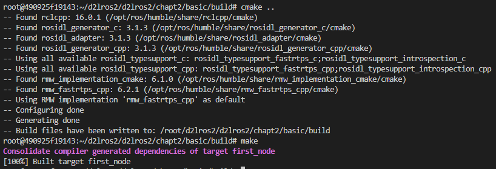

# 4.CMake依赖查找流程

上面我们用g++、make、cmake三种方式来编译ros2的C++节点。用cmake虽然成功了，但是CMakeLists.txt的内容依然非常的臃肿，我们需要将其进一步的简化。

## 1.优化CMakeList.txt

将上面的CmakLists.txt改成下面的样子

```cmake
cmake_minimum_required(VERSION 3.22)
project(first_node)

find_package(rclcpp REQUIRED)
add_executable(first_node first_ros2_node.cpp)
target_link_libraries(first_node rclcpp::rclcpp)
```

接着继续生成和编译

```
cmake ..
make
```



是不是非常的神奇，为什么可以浓缩成那么短的几句指令呢？

## 2.find_package查找路径

find_package查找路径对应的环境变量如下。

```
<package>_DIR
CMAKE_PREFIX_PATH
CMAKE_FRAMEWORK_PATH
CMAKE_APPBUNDLE_PATH
PATH
```

打开终端，输入指令：

```shell
echo $PATH
```

结果

```
PATH=/opt/ros/humble/bin:/usr/local/sbin:/usr/local/bin:/usr/sbin:/usr/bin:/sbin:/bin
```

观察PATH变量，你会发现`/opt/ros/humble/bin`赫然在其中，`PATH`中的路径如果以`bin`或`sbin`结尾，则自动回退到上一级目录，接着检查这些目录下的

```text
<prefix>/(lib/<arch>|lib|share)/cmake/<name>*/          (U)
<prefix>/(lib/<arch>|lib|share)/<name>*/                (U)
<prefix>/(lib/<arch>|lib|share)/<name>*/(cmake|CMake)/  (U)
```

cmake找到这些目录后，会开始依次找`<package>Config.cmake`或`Find<package>.cmake`文件。找到后即可执行该文件并生成相关链接信息。

打开`/opt/ros/humble/share/rclcpp/cmake`你会发现`rclcppConfig.cmake`就在其中。

## 3.总结

本节小鱼带你通过多种方式进行节点的编译，主要是让你了解C++编译工具cmake以及其路径查找规则，以后在学习生涯中再遇到`undefined reference to xxxxx`和` No such file or directory`就再也不用慌张了。


--------------

技术交流&&问题求助：

- **微信公众号及交流群：鱼香ROS**
- **小鱼微信：AiIotRobot**
- **QQ交流群：139707339**

- 版权保护：已加入“维权骑士”（rightknights.com）的版权保护计划