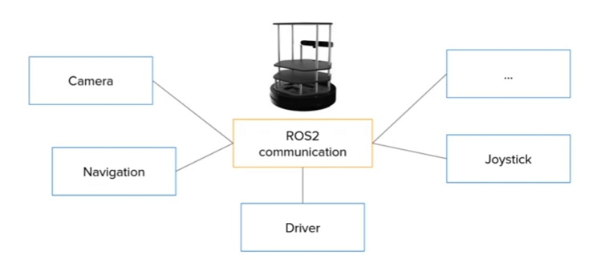
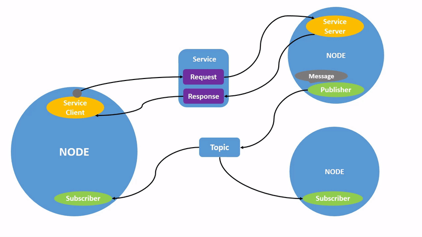

# 1.ROS2节点介绍

本节小鱼正式的来介绍节点的概念。

## 1. ROS2节点是什么

ROS2中每一个节点也是只负责一个单独的模块化的功能（比如一个节点负责控制车轮转动，一个节点负责从激光雷达获取数据、一个节点负责处理激光雷达的数据、一个节点负责定位等等）



## 2.节点之间如何交互？

上面举了一个激光雷达的例子，一个节点负责获取激光雷达的扫描数据，一个节点负责处理激光雷达数据，比如去除噪点。

那节点与节点之间就必须要通信了，那他们之间该如何通信呢？ROS2早已为你准备好了一共四种通信方式:

- 话题-topics
- 服务-services
- 动作-Action
- 参数-parameters

这四种种通信方式的用途和使用方法，小鱼放到了第四和第五章来介绍，到时候同时会带大家手撸代码。


官方给了一张图，大家先大概看一下，帮助理解

## 3. 如何启动一个节点？

知道了节点的概念之后，我们该如何启动一个节点呢？

因为工作空间和包的概念，小鱼放到了下一讲，这里大家跟着小鱼一起运行一个节点，感受一下。

使用指令：

```
ros2 run <package_name> <executable_name>
```

指令意义：启动 <package_name>包下的 <executable_name>中的节点。

**使用样例：**

```
ros2 run turtlesim turtlesim_node
```

大家可以尝试一下上面的指令，就是我们在第一章中启动小乌龟模拟器的那条指令。

运行之后可以看到一只小乌龟，接下来就可以试试下一节中提到的几个指令来查看节点信息和列表。


## 4. 通过命令行界面查看节点信息

### 4.1 ROS2命令行

ROS2的CLI，就是和ROS2相关的命令行操作。什么是命令行界面呢？这里小鱼再讲解一个概念，CLI（Command-Line Interface）和GUI（Graphical User Interface）

- GUI（Graphical User Interface）就是平常我们说的图形用户界面，大家用的Windows是就是可视化的，我们可以通过鼠标点击按钮等图形化交互完成任务。
- CLI（Command-Line Interface）就是命令行界面了，我们所用的终端，黑框框就是命令行界面，没有图形化。

很久之前电脑还是没有图形化界面的，所有的交互都是通过命令行实现，就学习机器人而言，命令行操作相对于图形化优势更加明显。

ROS2为我们提供了一系列指令，通过这些指令，可以实现对ROS2相关模块信息的获取设置等操作。

### 4.2 节点相关的CLI

运行节点(常用)

```
ros2 run <package_name> <executable_name>
```

查看节点列表(常用)：

```
ros2 node list
```

查看节点信息(常用)：

```
ros2 node info <node_name>
```

重映射节点名称

```
ros2 run turtlesim turtlesim_node --ros-args --remap __node:=my_turtle
```

运行节点时设置参数

```
ros2 run example_parameters_rclcpp parameters_basic --ros-args -p rcl_log_level:=10
```

## 5.总结

通过本节课的学习，希望大家对节点的概念有所了解，下一节小鱼带你一起学习工作空间的相关概念


- ROS2命令行工具源码;[ros2/ros2cli: ROS 2 command line interface tools (github.com)](https://github.com/ros2/ros2cli)

--------------

技术交流&&问题求助：

- **微信公众号及交流群：鱼香ROS**
- **小鱼微信：AiIotRobot**
- **QQ交流群：139707339**

- 版权保护：已加入“维权骑士”（rightknights.com）的版权保护计划