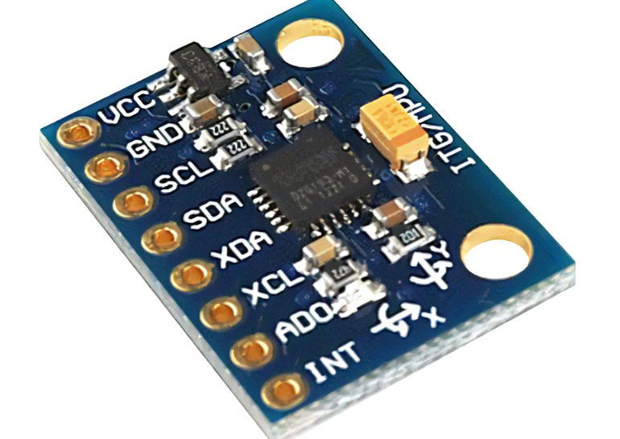
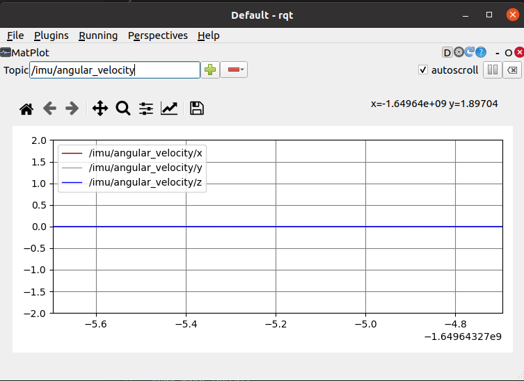

# 5.Gazebo仿真插件之IMU

大家好，我是小鱼，上节课通过配置两轮差速控制器我们已经成功的让fishbot在gazebo中动了起来，本节课我们通过给fishbot的URDF配置IMU传感器插件，让IMU模块工作起来。

## 1.惯性测量单元IMU介绍

惯性测量单元是测量物体三轴姿态角(或角速率)以及加速度的装置。一般的，一个IMU包含了三个单轴的加速度计和三个单轴的陀螺，加速度计检测物体在载体坐标系统独立三轴的加速度信号，而陀螺检测载体相对于导航坐标系的角速度信号，**测量物体在三维空间中的角速度和加速度**，并以此解算出**物体的姿态**。在导航中有着很重要的应用价值。

上面这段话是小鱼从百科中摘抄出来的，你需要知道的一个关键点是IMU可以测量以下三组数据：

- 三维角度
- 三维加速度
- 三维角速度

### 1.1 IMU长啥样？

便宜的长这样：




贵的长这样：


不要钱的长什么样？


仿真的不要钱哈哈，接着我们来配置一下仿真的IMU。


## 2.Gazebo-IMU插件介绍

仿真的IMU也是对应一个后缀为`.so`的动态链接库，使用下面的指令可以查看所有的动态链接库：

```
ls /opt/ros/humble/lib/libgazebo_ros*
```

```
/opt/ros/humble/lib/libgazebo_ros2_control.so
/opt/ros/humble/lib/libgazebo_ros_ackermann_drive.so
/opt/ros/humble/lib/libgazebo_ros_bumper.so
/opt/ros/humble/lib/libgazebo_ros_camera.so
/opt/ros/humble/lib/libgazebo_ros_diff_drive.so
/opt/ros/humble/lib/libgazebo_ros_elevator.so
/opt/ros/humble/lib/libgazebo_ros_factory.so
/opt/ros/humble/lib/libgazebo_ros_force.so
/opt/ros/humble/lib/libgazebo_ros_force_system.so
/opt/ros/humble/lib/libgazebo_ros_ft_sensor.so
/opt/ros/humble/lib/libgazebo_ros_gps_sensor.so
/opt/ros/humble/lib/libgazebo_ros_hand_of_god.so
/opt/ros/humble/lib/libgazebo_ros_harness.so
/opt/ros/humble/lib/libgazebo_ros_imu_sensor.so
/opt/ros/humble/lib/libgazebo_ros_init.so
/opt/ros/humble/lib/libgazebo_ros_joint_pose_trajectory.so
/opt/ros/humble/lib/libgazebo_ros_joint_state_publisher.so
/opt/ros/humble/lib/libgazebo_ros_node.so
/opt/ros/humble/lib/libgazebo_ros_p3d.so
/opt/ros/humble/lib/libgazebo_ros_planar_move.so
/opt/ros/humble/lib/libgazebo_ros_projector.so
/opt/ros/humble/lib/libgazebo_ros_properties.so
/opt/ros/humble/lib/libgazebo_ros_ray_sensor.so
/opt/ros/humble/lib/libgazebo_ros_state.so
/opt/ros/humble/lib/libgazebo_ros_template.so
/opt/ros/humble/lib/libgazebo_ros_tricycle_drive.so
/opt/ros/humble/lib/libgazebo_ros_utils.so
/opt/ros/humble/lib/libgazebo_ros_vacuum_gripper.so
/opt/ros/humble/lib/libgazebo_ros_video.so
/opt/ros/humble/lib/libgazebo_ros_wheel_slip.so
```

IMU对应的消息类型为`sensor_msgs/msg/Imu`

```
ros2 interface show sensor_msgs/msg/Imu
```

```
# This is a message to hold data from an IMU (Inertial Measurement Unit)
#
# Accelerations should be in m/s^2 (not in g's), and rotational velocity should be in rad/sec
#
# If the covariance of the measurement is known, it should be filled in (if all you know is the
# variance of each measurement, e.g. from the datasheet, just put those along the diagonal)
# A covariance matrix of all zeros will be interpreted as "covariance unknown", and to use the
# data a covariance will have to be assumed or gotten from some other source
#
# If you have no estimate for one of the data elements (e.g. your IMU doesn't produce an
# orientation estimate), please set element 0 of the associated covariance matrix to -1
# If you are interpreting this message, please check for a value of -1 in the first element of each
# covariance matrix, and disregard the associated estimate.

std_msgs/Header header

geometry_msgs/Quaternion orientation
float64[9] orientation_covariance # Row major about x, y, z axes

geometry_msgs/Vector3 angular_velocity
float64[9] angular_velocity_covariance # Row major about x, y, z axes

geometry_msgs/Vector3 linear_acceleration
float64[9] linear_acceleration_covariance # Row major x, y z
```

可以看到除了每个数据对应的三个协方差之外，每一个还都对应一个`3*3`的协方差矩阵。

## 3.给FIshbot配置IMU传感器

有了上节课的经验，我们可以很轻松的添加IMU传感器，但是还有一个需要注意的地方，为了更真实的模拟IMU传感器，我们需要给我们的仿真IMU传感器加点料。

加什么？加点高斯噪声，高斯噪声只需要指定平均值和标准差两个参数即可，不过因为IMU传感器的特殊性，我们还需要给模型添加两个偏差参数，分别是 `平均值偏差`和`标准差偏差`。

有关Gazebo仿真和噪声模型更深入的介绍可以参考小鱼发的两篇推文：

- [Gazebo仿真进阶教程之传感器高斯噪声（一）](https://mp.weixin.qq.com/s/0-OEATkyfMf6wEyrP5csGw)
- [Gazebo仿真进阶教程之传感器高斯噪声（二）](https://mp.weixin.qq.com/s/5k1SEGdASjUMbwWdSpf1PQ)

下面是IMU传感器的URDF配置代码，大家结合文章对应可以理解一下，IMU对应的插件库`libgazebo_ros_imu_sensor.so`

```
    <gazebo reference="imu_link">
      <sensor name="imu_sensor" type="imu">
      <plugin filename="libgazebo_ros_imu_sensor.so" name="imu_plugin">
          <ros>
            <namespace>/</namespace>
            <remapping>~/out:=imu</remapping>
          </ros>
          <initial_orientation_as_reference>false</initial_orientation_as_reference>
        </plugin>
        <always_on>true</always_on>
        <update_rate>100</update_rate>
        <visualize>true</visualize>
        <imu>
          <angular_velocity>
            <x>
              <noise type="gaussian">
                <mean>0.0</mean>
                <stddev>2e-4</stddev>
                <bias_mean>0.0000075</bias_mean>
                <bias_stddev>0.0000008</bias_stddev>
              </noise>
            </x>
            <y>
              <noise type="gaussian">
                <mean>0.0</mean>
                <stddev>2e-4</stddev>
                <bias_mean>0.0000075</bias_mean>
                <bias_stddev>0.0000008</bias_stddev>
              </noise>
            </y>
            <z>
              <noise type="gaussian">
                <mean>0.0</mean>
                <stddev>2e-4</stddev>
                <bias_mean>0.0000075</bias_mean>
                <bias_stddev>0.0000008</bias_stddev>
              </noise>
            </z>
          </angular_velocity>
          <linear_acceleration>
            <x>
              <noise type="gaussian">
                <mean>0.0</mean>
                <stddev>1.7e-2</stddev>
                <bias_mean>0.1</bias_mean>
                <bias_stddev>0.001</bias_stddev>
              </noise>
            </x>
            <y>
              <noise type="gaussian">
                <mean>0.0</mean>
                <stddev>1.7e-2</stddev>
                <bias_mean>0.1</bias_mean>
                <bias_stddev>0.001</bias_stddev>
              </noise>
            </y>
            <z>
              <noise type="gaussian">
                <mean>0.0</mean>
                <stddev>1.7e-2</stddev>
                <bias_mean>0.1</bias_mean>
                <bias_stddev>0.001</bias_stddev>
              </noise>
            </z>
          </linear_acceleration>
        </imu>
      </sensor>
    </gazebo>
```

将上面的代码加到`fishbot_gazebo.urdf`中，接着我们就可以进行测试了。

## 4.编译测试

编译

```shell
colcon build
```

运行

```
ros2 launch fishbot_description gazebo.launch.py
```

CLI看话题

```
ros2 topic list
ros2 topic info /imu
```

```
ros2 topic echo /imu
```

输出：

```
header:
  stamp:
    sec: 150
    nanosec: 599000000
  frame_id: base_footprint
orientation:
  x: 3.434713830866392e-07
  y: 7.119913105768616e-06
  z: -0.00028312437320413914
  w: 0.9999999598948884
orientation_covariance:
- 0.0
- 0.0
- 0.0
- 0.0
- 0.0
- 0.0
- 0.0
- 0.0
- 0.0
angular_velocity:
  x: -0.00013597855247901325
  y: 0.0006306135617081868
  z: -0.00015794894627685146
angular_velocity_covariance:
- 4.0e-08
- 0.0
- 0.0
- 0.0
- 4.0e-08
- 0.0
- 0.0
- 0.0
- 4.0e-08
linear_acceleration:
  x: 0.08679200038530369
  y: 0.07753419258567491
  z: 9.687910969061628
linear_acceleration_covariance:
- 0.00028900000000000003
- 0.0
- 0.0
- 0.0
- 0.00028900000000000003
- 0.0
- 0.0
- 0.0
- 0.00028900000000000003
```

用rqt可视化：




## 5.总结

本节我们对IMU传感器进行介绍，并通过gazbeo的imu插件完成了fishbot的IMU数据的输出。

最后还有小练习等着你：

1. 再次启动遥控节点，控制fishbot，观察IMU传感器的数据变化


--------------

技术交流&&问题求助：

- **微信公众号及交流群：鱼香ROS**
- **小鱼微信：AiIotRobot**
- **QQ交流群：139707339**

- 版权保护：已加入“维权骑士”（rightknights.com）的版权保护计划为FishBot添加IMU传感器